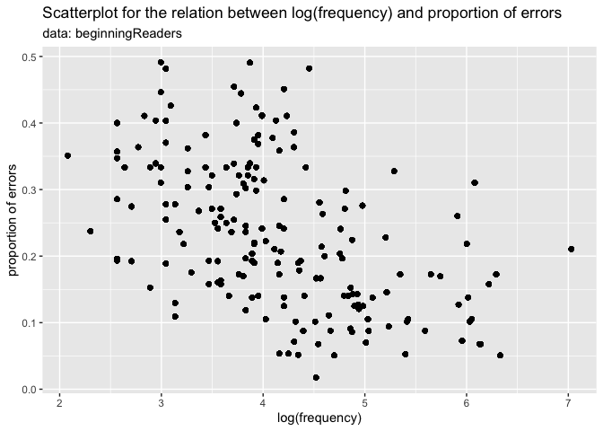
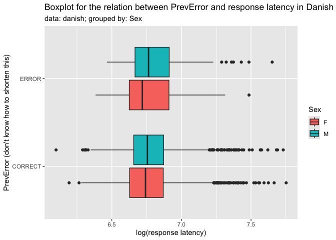
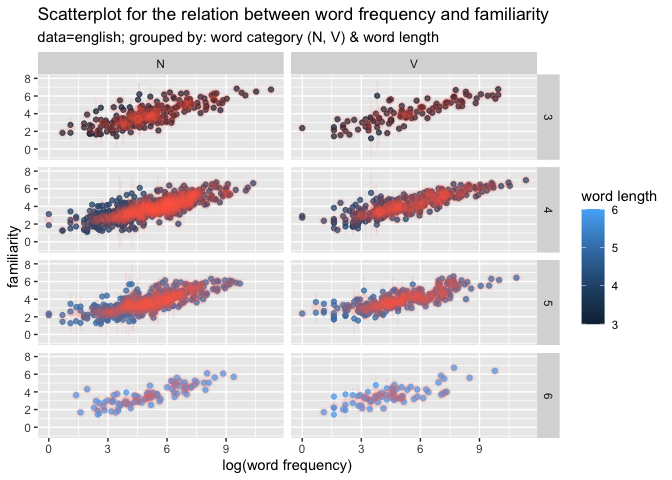

``` r
# LogFrequency: a numeric vector with log-transformed frequency in Vermeer's frequency dictionary of Dutch children's texts
# ProportionOfErrors: a numeric vector for the proportion of error responses for the word
# "lab" were asked from GPT
library(languageR)
library(tidyverse)
beginningReaders |>
  ggplot() +
  aes(x = LogFrequency, y = ProportionOfErrors) +
  geom_point() +
  labs(
    title = "Scatterplot for the relation between log(frequency) and proportion of errors",
    subtitle = "data: beginningReaders",
    x = "log(frequency)",
    y = "proportion of errors"
  )
```

<!-- -->


``` r
# PrevError: factor with levels CORRECT and ERROR coding whether the preceding trial elicited a correct lexical decision
# LogRT: the dependent variable, log response latency
# Sex: factor coding the sex of the participant, with levels F (female) and M (male)
danish |>
  ggplot()+
  aes(x = PrevError, y = LogRT, fill = Sex) +
  geom_boxplot(position = "dodge2") +
    labs(
    title = "Boxplot for the relation between PrevError and response latency in Danish",
    subtitle = "data: danish; grouped by: Sex",
    x = "PrevError (don't know how to shorten this)",
    y = "log(response latency)"
  )+
  coord_flip()
```

<!-- -->


``` r
# WrittenFrequency: numeric vector with log frequency in the CELEX lexical database
# Familiarity: numeric vector of subjective familiarity ratings
# LengthInLetters: numeric vector with length of the word in letters.
# AgeSubject: a factor with as levels the age group of the subject: young versus old
# WordCategory: a factor with as levels the word categories N (noun) and V (verb)
english |>
  select(wf = WrittenFrequency, fm = Familiarity, age = AgeSubject, len = LengthInLetters, cat = WordCategory) |>
  filter(len > 2 & len < 7, age == "young") |>
  ggplot() +
  aes(x = wf, y = fm, colour = len, position = "jitter") +
  geom_point(alpha = 0.75) +
  labs(
    title = "Scatterplot for the relation between word frequency and familiarity",
    subtitle = "data=english; grouped by: word category (N, V) & word length",
    x = "log(word frequency)",
    y = "familiarity",
    color = "word length"
  ) +
   facet_grid(len ~ cat) +
  stat_summary(
    fun.data = mean_sdl, 
    alpha=0.1, colour = "tomato")
```

<!-- -->
